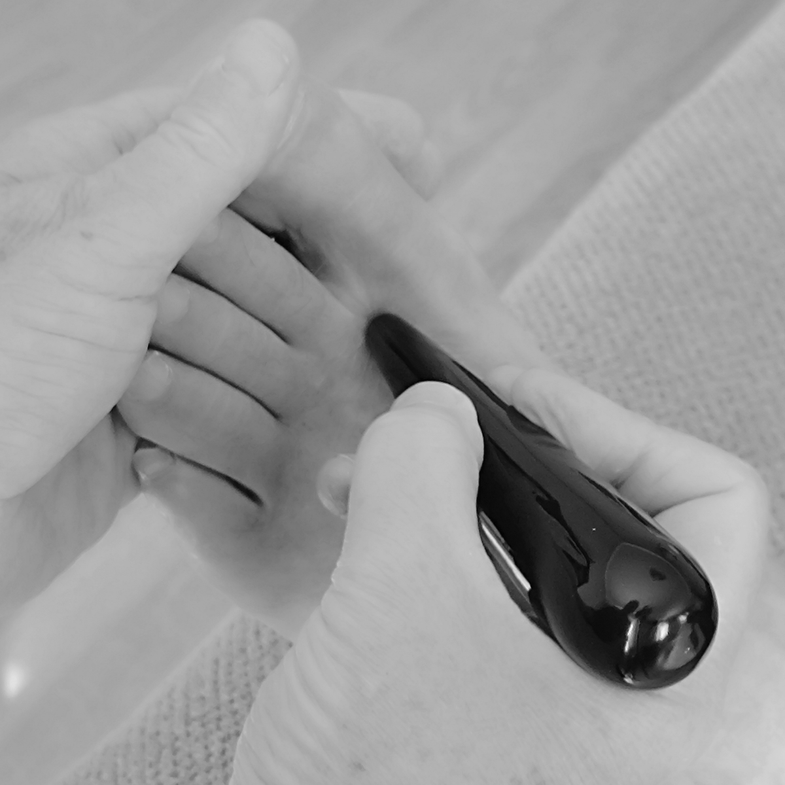

# Réflexologie Côtière


---

## 🌱 Project Overview
Réflexologie Côtière is a web application for booking and managing reflexology sessions, built as part of the French "Développeur Web et Web Mobile" (DWWM) certification. It features appointment scheduling, user dashboards, admin management, and a responsive, accessible UI.

---

## 🚀 Features
- User registration, authentication, and dashboard
- Appointment booking with calendar integration
- Admin dashboard for managing sessions, users, and availability
- Contact form and messaging system
- Responsive design for mobile and desktop
- Secure authentication and CSRF protection

---

## 👤 User Stories
- As a visitor, I can view information about reflexology and available sessions.
- As a user, I can register, log in, and book appointments online.
- As a user, I can view my upcoming and past appointments, invoices, and messages.
- As an admin, I can manage users, sessions, and availability slots.

---

## 🖼️ Mockup & Screenshots
> _Add screenshots or a link to your Figma/AdobeXD mockup here._

- 
- 

---

## 🛠️ Tech Stack
- **Backend:** Symfony 6, Doctrine ORM, PHP 8+
- **Frontend:** Twig, HTML5, CSS3, JavaScript (FullCalendar)
- **Database:** MySQL
- **Other:** Composer, PHPUnit

---

## 📱 Responsive & Accessibility
- Mobile-first CSS with media queries
- Semantic HTML structure
- Accessible navigation and forms (alt/aria-labels, keyboard navigation)

---

## 🏗️ Setup & Usage
```bash
# Clone the repo
$ git clone <repo-url>
$ cd reflexologieCotiere

# Install dependencies
$ composer install
$ npm install # if using asset bundler

# Set up environment
$ cp .env.example .env
# Edit .env for your DB credentials

# Run migrations
$ php bin/console doctrine:migrations:migrate

# Start the server
$ symfony server:start
```

---

## 📋 DWWM Competencies Checklist
- [x] Responsive, accessible UI
- [x] Secure authentication & CSRF
- [x] MVC architecture
- [x] User stories & mockup
- [x] English code comments
- [ ] Technical research documentation
- [ ] Unit/integration tests
- [ ] Vulnerability research documentation

---

## 🔍 Technical Research (Sample)
> _This project implements CSRF protection using Symfony’s built-in features, as recommended in the [Symfony Security Docs](https://symfony.com/doc/current/security/csrf.html) and [OWASP CSRF Prevention Cheat Sheet](https://cheatsheetseries.owasp.org/cheatsheets/Cross-Site_Request_Forgery_Prevention_Cheat_Sheet.html)._ 

- All forms include a CSRF token to prevent cross-site request forgery.
- Authentication and password hashing follow Symfony and OWASP best practices.

---

## 🛡️ Security Practices
- CSRF protection enabled for all forms
- Passwords hashed using modern algorithms
- User input validated and sanitized
- Access control enforced via roles and permissions
- Output auto-escaped in Twig templates


---

## 👨‍💻 Author
Annick Brunel (project), Samy Mechiche (dev)

---

## 📞 Contact
- reflexologiecotiere@gmail.com
- [Website](#)
